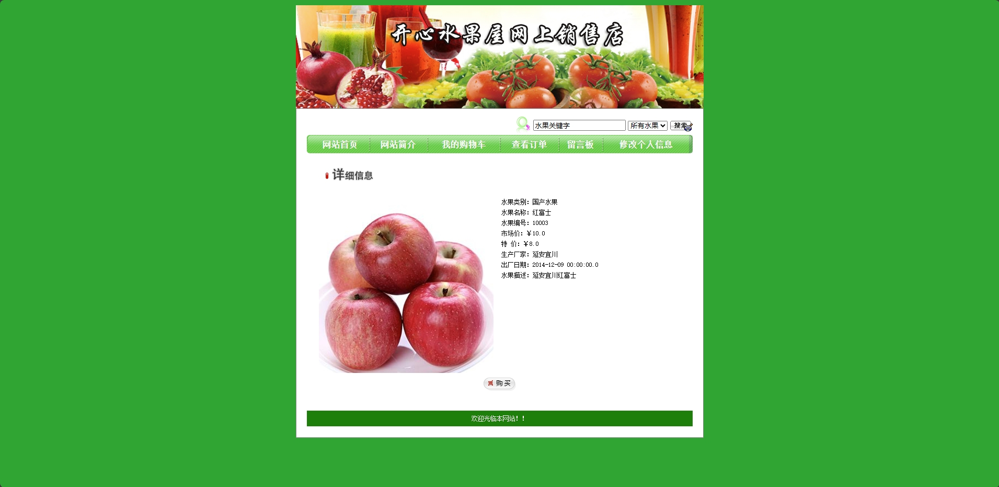
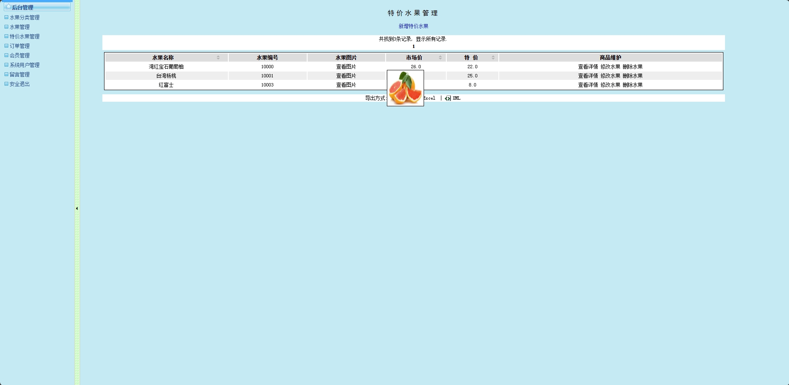
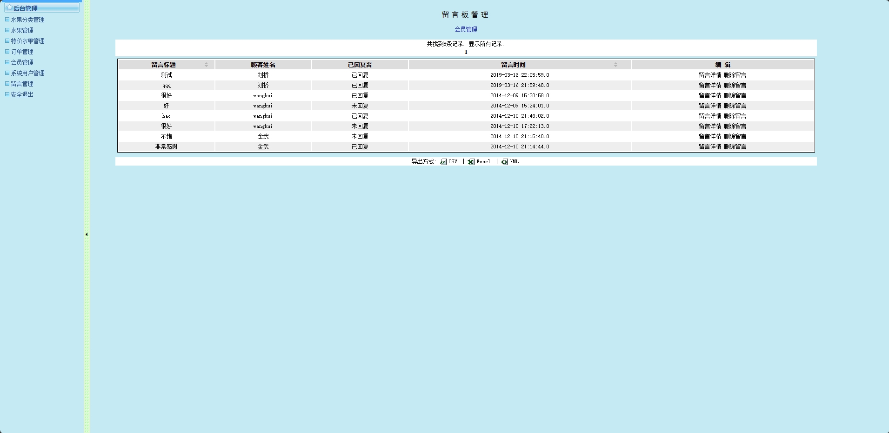

<h1 align="center">基于ssh的水果店营销管理系统</h1>

<h4> 完整代码获取地址：从戎源码网（https://armycodes.com/） </h4>
<h4> 作者微信：19941326836 QQ：605739993 QQ群：655392706 </h4>
<h4> 承接计算机毕设、Java毕业设计、Python毕业设计、深度学习、机器学习 </h4>
<h4> 选题+开题报告+任务书+程序定制+安装调试+论文+答辩ppt 一条龙服务 </h4>
<h4> 毕业设计所有选题地址：(https://github.com/Descartes007/allProject) </h4>

## 一、项目介绍
基于ssh的水果店营销管理系统：前端 jsp、js，后端 struts、hibernate；角色分为管理员和用户，管理员在管理端对水果分类、特价水果、订单、会员和用户等功能进行管理；用户可以挑选自己的意向水果，通过水果类别选择心仪水果，购买和支付生成商品订单，可以对系统留言等。主要功能如下：

### 1、管理员：

- 基本操作：登录、修改密码、修改个人信息、上传图片、获取个人信息、导出附件（CSV、Excel）、登出
- 水果分类管理：获取水果分类信息列表、删除水果分类信息、修改水果分类信息、导出附件（CSV、Excel）、添加水果分类信息
- 水果管理：获取水果信息列表、删除水果信息、修改水果信息、导出附件（CSV、Excel）、添加水果分类信息
- 特价水果管理：获取特价水果信息列表、删除特价水果信息、修改特价水果信息、导出附件（CSV、Excel）、添加特价水果分类信息
- 订单管理：获取订单信息列表、删除订单信息、导出附件（CSV、Excel）、结单、查看订单信息详情
- 会员管理：获取会员列表、删除会员信息、查看会员信息详情、会员等级调整、导出附件（CSV、Excel）
- 留言板管理：获取留言板列表、删除留言板信息、查看留言板信息详情、回复留言、导出附件（CSV、Excel）
- 系统管理员管理：获取系统管理员列表、修改系统管理员信息、删除系统管理员信息、添加系统管理员信息、查看系统管理员信息详情、导出管理员记录（CSV、Excel导出）

### 2、用户：

- 基本操作：登录、修改密码、修改个人信息、获取个人信息、注册、收货地设置、网站简介
- 商品模块：获取商品列表、筛选商品信息、查看商品详情、添加购物车、支付、获取店家分类、清空购物车
- 留言板模块：获取留言板列表、查看留言详情、回复留言、发表留言
- 订单模块：获取订单列表、查看订单详情、支付、确认收货

## 二、环境

- <b>IntelliJ IDEA 2020.3</b>

- <b>Mysql 5.7.26</b>

- <b>Tomcat 9.0.41</b>

- <b>JDK 1.8</b>

## 三、运行截图

